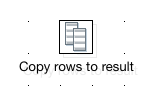
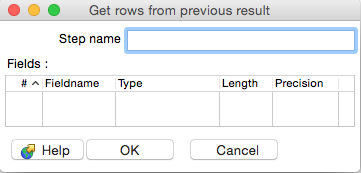
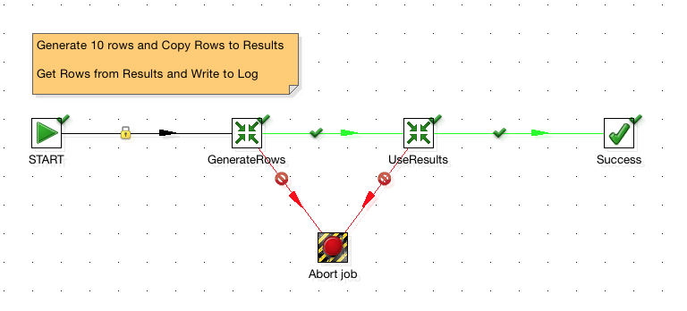
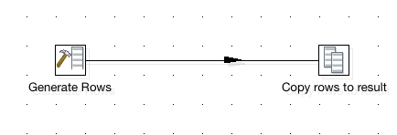
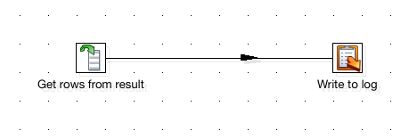

## Results
Within PDI the *results* concept is used to store a set of rows in memory. It allows you to load and transform some
data, then use the *results* to store the transformed data to be obtained by another transformation.

In order to add rows to the results set, you simply use the **Copy rows to results** step:

To retrieve the rows in another transformation, you use the **Get rows from results** step:

By leaving all options within this step blank, it will obtain all the rows from results, however you can specify the
specific column(s) you wish to obtain too by name; in the example they are blank like so:

## Example

The following is an example of a **Job** containing two **Transformations**.

The first transformation generates 10 rows of containing the string "Hello World!" and copies those rows to result.

The second transformation gets the rows from results and outputs them to the log.

Here is the final log:

