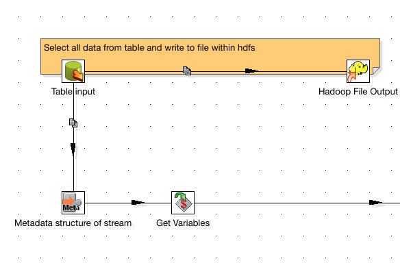
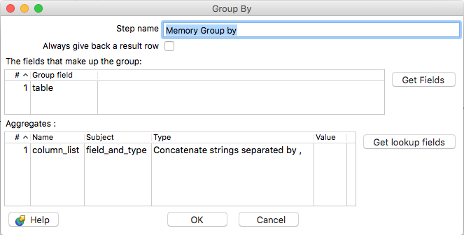
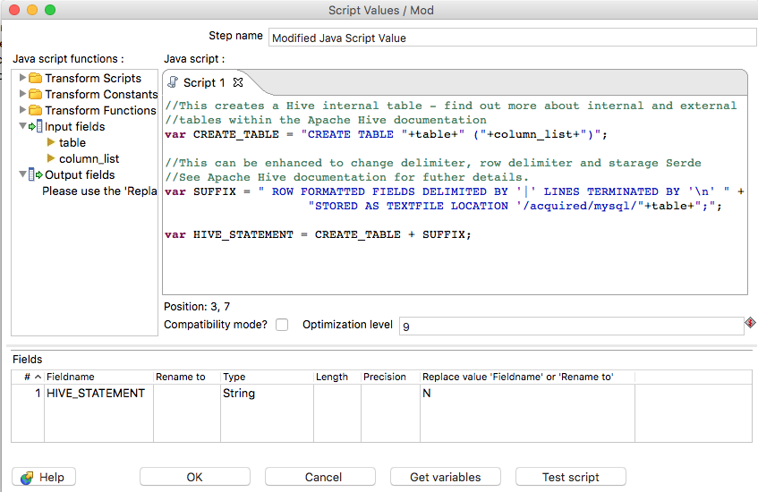
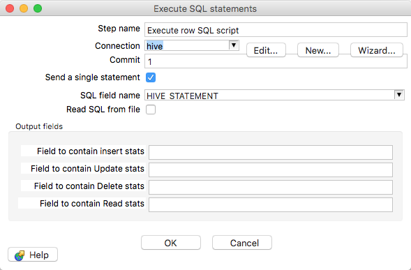

This is Part 3b of the Pentaho series where I will be continuing to demonstrate how to easily migrate a MySQL database to hive.

The first part of this post can be found [here](http://gavlaaaaaaaa.github.io/Pentaho-Migrate-Hive/). Head over to the [homepage](http://gavlaaaaaaaa.github.io/) for more posts.

##Recap
We have no successfully built pentaho transoformations to import data from each table within the MySQL database and write it to HDFS.
Now we need to build Hive tables to represent this data.

##Step 1 - Obtaining Metadata from the stream
Data will be obtained by the *Table Input* step and PDI will fit the table schema into its own stream. In order to make the most of this and re-use it, we can use the built in *Metadata structure from Stream* step.

This step will give us the column names and their data types as determined by PDI. If we now add a *Get Variables* step to the stream to get our **table** variable. Now we have everything we need as a baseline to create our Hive tables

##Step 2 - Converting Data types
One of the fields output from the *Metadata structure from Stream* step is the **Type** field. This specifies the data type of each column. Due to the differences between MySQL and Hive types, we will need to do some conversion.

This can be done in numerous ways: using a regex replace step twinned with some JavaScript, using a Map Values step; although for us this wouldnt be suitable, or by simply using the *Replace in string* step to do a simple find and replace. This should be set up as follows.

The Transformation up until this point should look as follows:

##Step 3 - Transform the schema data
Currently, the stream is not in a position where we can easily generate a Create Tables statement to be issued to Hive. In this step, we will look at how we can get our current rows containing schema data all onto one row.

Firstly, we need to concatenate the column name and converted data type together using a space as a delimiter. This means we will have each column name with its type in the following format *[COLUMN] [TYPE]*

Now we need to pivot all those rows of Column Type concatinations onto a single row, seperated by a comma. This will make it really easy to generate a Hive statement, as like SQL the syntax requires a comma seperated list of column names and their types.

To do this, we will use a *Memory Group by* step as follows.

This will produce a single row with two columns: the table name and a comma seperated list of columns and data types. Now all thats left is to add the rest of the syntax around the edged.

##Step 4 - Completing the Hive statement
Now we need to add the surrounding syntax to for our Hive statement so we end up with a statement like follows:

`CREATE TABLE [tablename] (col type, col2 type, col..) ROW FORMATTED FIELDS DELIMITED BY '|' LINES TERMINATED BY '\n' STORED AS TEXTFILE LOCATION /acquired/mysql/[tablename]`

To do this we will use a *Modified Java Script Value* step to easily concatenate these strings as follows:

##Step 5 - Executing the statement
We have our final Hive statement and now just need to send it be executed by Hive. We can use the *Execute row SQL step* that can be used to send any row of SQL to be executed via JDBC.

This should be configured as follows.

Our final Transformation should look like this. 

I've added some extra error handling, and also at the beginning a *Detect empty stream* step that will send a dummy row down the stream if a table is empty, so it will still be created in Hive in case it is needed at a later date.

##Conclusion
This concludes the Migration from MySQL to Hive - this application can now be run from start to finish in order to ingest MySQL data to Hive.

Note: this series was designed to show you the basics of PDI with a hands on example. There are tools out there that can easily migrate databases into Hive, such as Apache SQOOP - however I wanted to demonstrate the capabilities of PDI.

I hope this was useful, let me know if you have any other topics you'd like covered.
