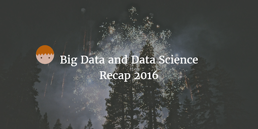

--- 
layout: post 
title:  Big Data and Data Science Recap 2016
author: Lewis Gavin 
comments: true 
tags: 
- data science
- big data
---

As the year draws to a close, I'd like to take the opportunity to reflect on what I've learnt in 2016. Towards the start of this year, I started this blog as a tool to simply store information on topics I'd learnt so that I could revisit them when needed. I then had a revelation that this information would not only be useful to me, but to others in my field: so I began sharing it!

I integrated Google Analytics and this has allowed me to track how the blog has grown from a couple hundred sessions a month to over two thousand and has been slowly rising!

The spike has been due to the increased volume of blog posts, after setting myself a challenge to write a post a week since around June/July.

So what have I learnt and what could you learn from my posts? And what will I be doing with the blog next year?

## End of Year Recap!

### 10 Steps to Big Data
1. Learn how to ingest data from your Data Warehouse into Hadoop with [Apache SQOOP](http://www.lewisgavin.co.uk/Data-Ingestion-SQOOP/) and [Apache Flume!](http://www.lewisgavin.co.uk/Flume/)
2. Transform your data into Hive structures ready for analytics using [Pentaho Data Integration for ETL](http://www.lewisgavin.co.uk/Pentaho-Migrate-Hive/)
3. Find out what I learnt from the [Strata and Hadoop World Conference in London](http://www.lewisgavin.co.uk/Strata-Hadoop/)
4. Understand [Real Time Streaming concepts through Apache Kafka](http://www.lewisgavin.co.uk/Streaming-Kafka/) and [How to scale spark streaming applications](http://www.lewisgavin.co.uk/Advanced-Spark-Streaming/)
5. [Use Apache Kudu for RDMS like data storage alongside your Hadoop cluster](http://www.lewisgavin.co.uk/Apache-Kudu/)
6. **My most popular post of the year! [Learn how to improve the performance of your Spark applications](http://www.lewisgavin.co.uk/Spark-Performance/)**
7. [Build a search engine with Elasticsearch](http://www.lewisgavin.co.uk/Search-Engine-Elasticsearch/)
8. Begin performing [analytics on your data in Real-Time with Apache Spark](http://www.lewisgavin.co.uk/Spark-Streaming/)
9. Follow the Big Data Journey to learn the whole Big Data pipeline from ingestion to analytics - [Part 1](http://www.lewisgavin.co.uk/CDH-Docker/), [Part 2](http://www.lewisgavin.co.uk/Data-Ingestion-Kafka-Spark/), [Part 3](http://www.lewisgavin.co.uk/Kudu-Spark/) and [Part 4](http://www.lewisgavin.co.uk/CDE-Dashboard/)
10. Understand the [differences between RDBMS and NoSQL data stores](http://www.lewisgavin.co.uk/NoSQLvsRDBMS/) and gain knowledge of how to use [Apache HBase](http://www.lewisgavin.co.uk/HBase-Intro/)

### The road to Data Science

1. [Take the Data Science 101 class](http://www.lewisgavin.co.uk/Intro-Data-Science/)
2. See how we run our first [Data Science Hackathon at Capgemini](http://www.lewisgavin.co.uk/Data-Science-Hackathon/)
3. Step into [Machine Learning with this simple intro on Naive Bayes](http://www.lewisgavin.co.uk/Machine-Learning-Basics/)
4. Step 2 of classification - [Support Vector Machines](http://www.lewisgavin.co.uk/Machine-Learning-SVM/)
5. Finishing off classification with [Decision Trees](http://www.lewisgavin.co.uk/Machine-Learning-Decision-Tree/)
6. Moving into [Clustering for recommendations with K-Means clustering](http://www.lewisgavin.co.uk/Machine-Learning-Kmeans/)
7. [Sarcasm Detection using Machine Learning in Spark] (http://www.lewisgavin.co.uk/Sarcasm-Detector/)
8. Better understand Textual data with [Natural Language Processing](http://www.lewisgavin.co.uk/NLP/)

### Everything In-Between

1. What did I learn from being a [part of an evolving agile team](http://www.lewisgavin.co.uk/Agile-What-Have-I-Learnt/) at a large company.
2. I went to [SAS Forum in the UK](http://www.lewisgavin.co.uk/SAS-Forum-UK/) for their new product launch
3. Some android programming to build a fitness app - this was a neat algorithm to [calculate how far you've ran without using GPS](http://www.lewisgavin.co.uk/Step-Tracker-Android/)

## What's Next

I will continue to issue my newsletter in the new year so please sign up using the form at the top or bottom of this page.

I will also look to introduce new types of content to the blog. Don't worry, the technical big data and data science posts will still exists however I will look to bring in posts on other topics such as process and behaviour improvement and the tools and techniques I use to improve how I live and work.

Thanks for a great year and I hope to see you all back here in 2017!
